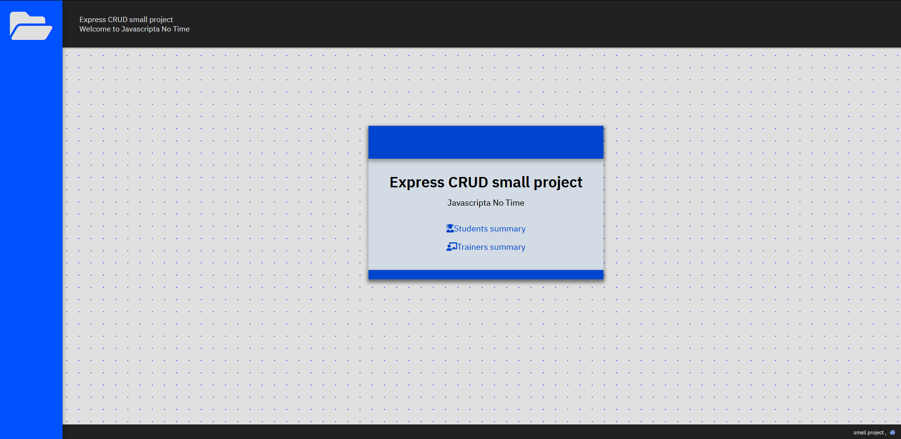

class repo: [https://github.com/davidoster/myapp](https://github.com/davidoster/myapp)

 

# Express CRUD application

PORT: `3300`

Generated with [express-init](https://github.com/demetreades/express-init)

 

 

## 1. Clone repo and cd into `/myapp` folder

`pwd` for current path

`git clone https://github.com/demetreades/myapp.git`

`dir` or `ls` for files list

`cd myapp` if you are not already into

## 2. Install dependencies

If you cloned the repo you need to install dependencies first as described in the `package.json` 

`npm install`

## 3. Run app

`npm start` listening at port: `3300`

## 4. Navigate to:

 

List of current active urls:

|URLs       |Endpoints                         | 
|:----------|:---------------------------------|
|[localhost:3300](http://localhost:3300) |  /  | 
|[localhost:3300/students/](http://localhost:3300/students/)             |  students/       | 
|[localhost:3300/students/new](http://localhost:3300/students/new)       |  students/new/   |  
|[localhost:3300/students/update](http://localhost:3300/students/update) | students/update/ | 
|[localhost:3300/students/delete](http://localhost:3300/students/update) | students/delete/ | 

 

 

 

 

 

 

 

 

 

 

🤿 

enjoy
