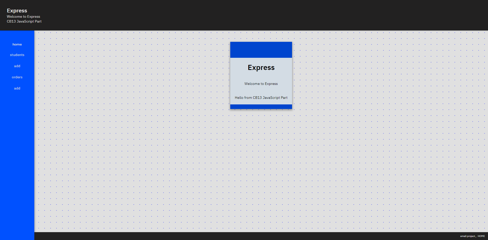

# myapp
 Generated with express-generator

If we have downloaded a node project from internet we need to install dependencies

---

## 0!. Clone repo and cd into `/myapp/` folder

`pwd` for current path

`git clone https://github.com/demetreades/myapp.git`

`dir` or `ls` for files list

`cd myapp` if you are not already into

 

## 1. Install node modules

If we create a new project from scratch we need to perform the following actions: 

`npm install`

## 2. Start www

`npm start `

## 3. Navigate to:

 

| urls        |    /  | 
|----------|:-------------:|
|[localhost:3000](http://localhost:3000) | home | 
|[localhost:3000/students/](http://localhost:3000/students/) |  students/ | 
|[localhost:3000/students/new](http://localhost:3000/students/new) |  students/new/ | 
|[localhost:3000/students/update](http://localhost:3000/students/update) | students/update/ | 
|[localhost:3000/students/delete](http://localhost:3000/students/update) | students/delete | 
|[localhost:3000/orders/](http://localhost:3000/orders/) |  orders/ | 
|[localhost:3000/orders/new](http://localhost:3000/orders/new) |  orders/new/ | 
|[localhost:3000/orders/update](http://localhost:3000/orders/update) | orders/update/ | 
|[localhost:3000/orders/delete](http://localhost:3000/orders/update) | orders/delete | 

 

 

enjoy
