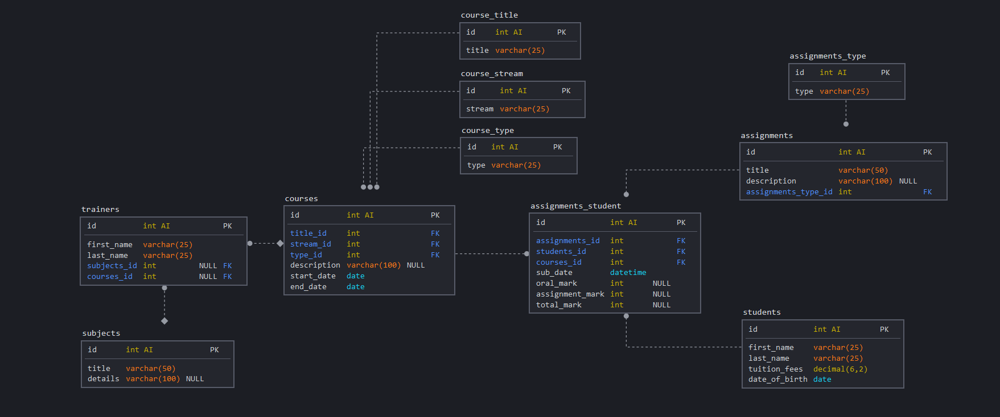

# Express CRUD small school project

 

PORT: `4000`

Generated with [express-generator](https://expressjs.com/en/starter/generator.html).

 

<small>View via Firefox for proper styling</small>

 

<small>ER diagram</small>

 

### Requires:

1. [Node.js 14.17+](https://nodejs.org/en/download/)

2. [MySQL 8.0.25+](https://dev.mysql.com/downloads/)

 

## 1. Clone repository

    git clone https://github.com/demetreades/myapp.git

`pwd` for current path.

`ls` for file list.

`cd /myapp` if you are not already into.

 

## 2. Install dependencies

If you cloned the repo you need to install dependencies first as listed in the `package.json`.

    npm i or yarn

 

## 3. Generate database

- Firstly fill your local credentials into `/database/seeder.js`

       npm run DATA:import

  Run `DATA:import` script to generate, use schema, create and populate tables.

 

- You also need to fill again your local credentials at `/database/credentials.js` for the main connection with the newly created database, for the server to start properly via start script.

 

## 4. Start server

    npm start

 

## 5. Navigation

List of current active endpoints:

 

| URLs                                                        | Endpoints |
| :---------------------------------------------------------- | :-------- |
| [localhost:4000](http://localhost:4000)                     | /         |
| [localhost:4000/students/](http://localhost:4000/students/) | students/ |
| [localhost:4000/trainers/](http://localhost:4000/trainers/) | trainers/ |

 

Class repo: [David Oster myapp](https://github.com/davidoster/myapp)

 

 

 

 

 

 

🤿

enjoy
